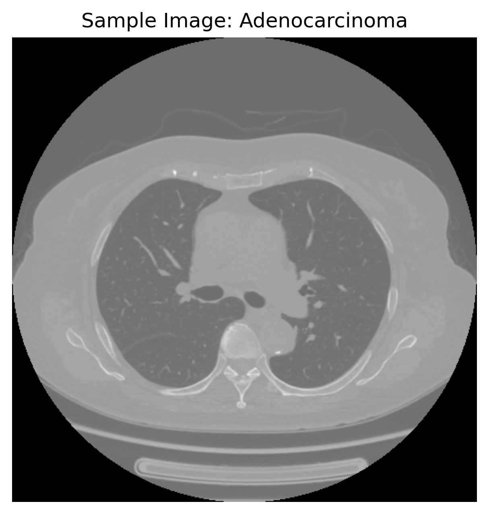
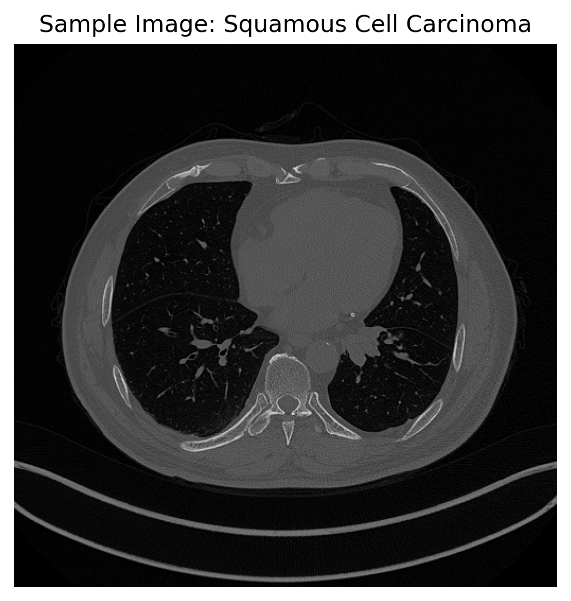
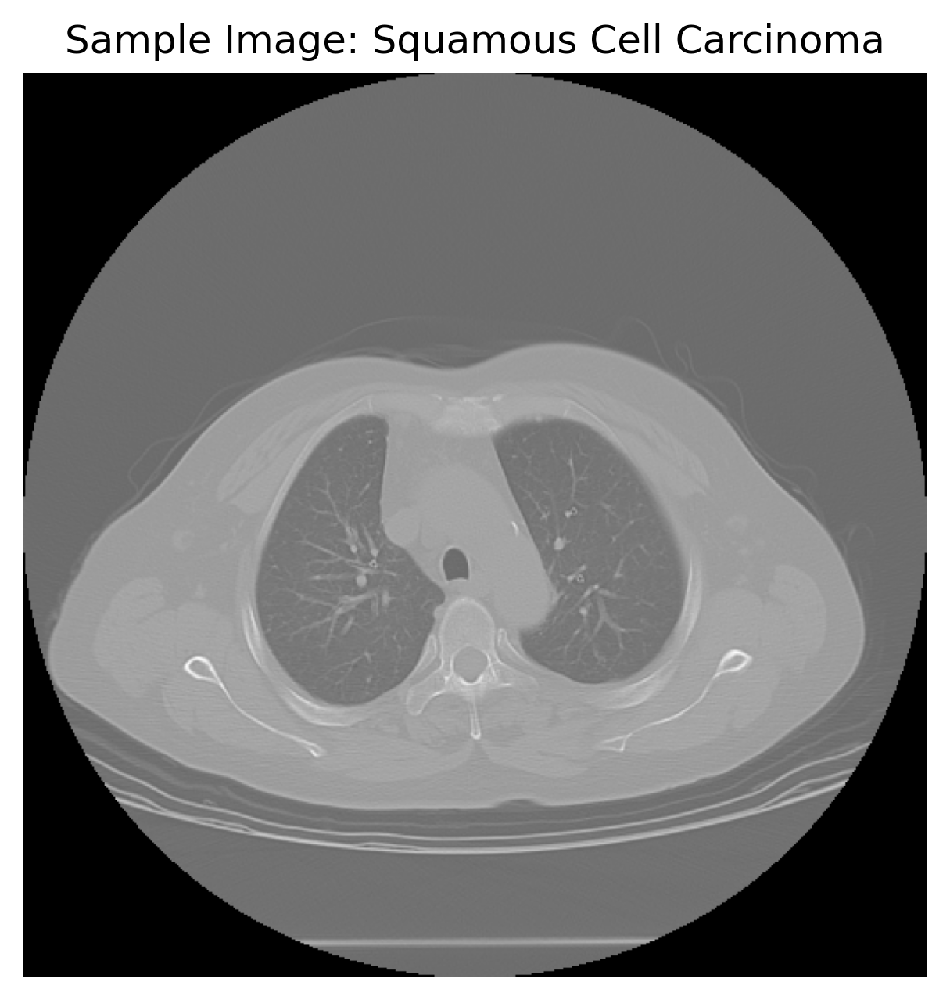

# PET Image Classification for Lung Cancer Subtypes

## Project Overview

This project explores **lung cancer subtype classification using PET scan data**. The goal is to extract meaningful **radiomics-inspired features** from medical images and train a machine learning model to distinguish between cancer types.

The pipeline demonstrates:

- Medical image preprocessing (DICOM handling)  
- Feature extraction (intensity, texture, shape proxies)  
- Machine learning classification  
- Model evaluation using clinically relevant metrics  

## Dataset

- Source: Lung Cancer PET/CT dataset (DICOM format)  
- Classes:
  - Adenocarcinoma  
  - Squamous Cell Carcinoma  
  - Small Cell Carcinoma  
  - Large Cell Carcinoma  

- Total samples: ~18,500 slices  

  **Important limitations**
 - No tumor segmentation masks available  
 - No patient-level identifiers (possible data leakage)  
 - Slice-level classification instead of patient-level analysis  

## Methodology

### 1. Data Loading & Preprocessing

- DICOM images loaded using `pydicom`  
- Pixel intensities normalized to [0, 1]  
- Empty or invalid images removed  


### 2. Feature Extraction

Each image is represented using three groups of features:

#### Intensity Features
- Mean intensity  
- Standard deviation  
- Maximum intensity  
- 10th and 90th percentiles  

#### Texture Features (GLCM)
- Contrast  
- Homogeneity  
- Energy  

These features capture spatial intensity patterns in the image.

#### Shape Proxy
- Approximate “high-intensity region volume” using percentile thresholding  

 This is a **proxy feature**, not true tumor segmentation.


### 3. Model Training

- Model: **Random Forest Classifier**
- Parameters:
  - `n_estimators = 200`
  - `class_weight = "balanced"`

- Validation strategy:
  - Train/test split (80/20)
  - 5-fold stratified cross-validation  


## Results

### Cross-Validation Performance

CV Scores: [0.8027027  0.79324324 0.80033784 0.80439189 0.80709459]

Mean CV: 0.802


```
Classification Report
                         precision    recall  f1-score   support

         Adenocarcinoma       0.82      0.95      0.88      2000
   Large Cell Carcinoma       0.78      0.39      0.52       100
   Small Cell Carcinoma       0.82      0.62      0.70       600
Squamous Cell Carcinoma       0.81      0.70      0.75      1000

               accuracy                           0.81      3700
              macro avg       0.81      0.66      0.71      3700
           weighted avg       0.81      0.81      0.81      3700
```


## Visualizations

### Confusion Matrix


*Figure: Model performance across cancer subtypes.*


### ROC Curves


*Figure: ROC curves showing class-wise separability.*


### Feature Importance


*Figure: Most influential features used by the model.*


### Sample PET Slices

<p align="center">
  
  
  
</p>

*Figure: Example PET slices from the dataset.*

 Note: No ROI overlays are shown to avoid misleading interpretation.


## Key Insights

- The model achieves **~81% accuracy**, indicating that radiomics-style features contain predictive signal  
- Strong performance for **Adenocarcinoma**, weaker for **Large Cell Carcinoma** due to class imbalance  
- Texture and intensity features are the most informative  


## ⚠️ Limitations

This project highlights real-world challenges in medical imaging:

-  No tumor segmentation masks → no true ROI-based features  
-  Slice-level splitting → potential data leakage  
-  Class imbalance impacts minority classes  
-  PET intensities not standardized (no SUV normalization)  


## Future Improvements

- Patient-level splitting to avoid leakage  
- Integration of tumor segmentation masks  
- Deep learning models (CNNs, 3D architectures)  
- Standardized radiomics (e.g., PyRadiomics)  
- Multimodal learning (PET + CT)  


## Relevance for Medical Imaging Roles

This project demonstrates:

- Experience with **DICOM medical imaging workflows**  
- Understanding of **radiomics feature extraction**  
- Ability to build and evaluate **machine learning models**  
- Awareness of **clinical and methodological limitations**  


## Final Note

This project focuses on building a **transparent, reproducible ML pipeline** rather than presenting misleading visual results. All limitations are explicitly acknowledged to reflect real-world medical imaging challenges.
